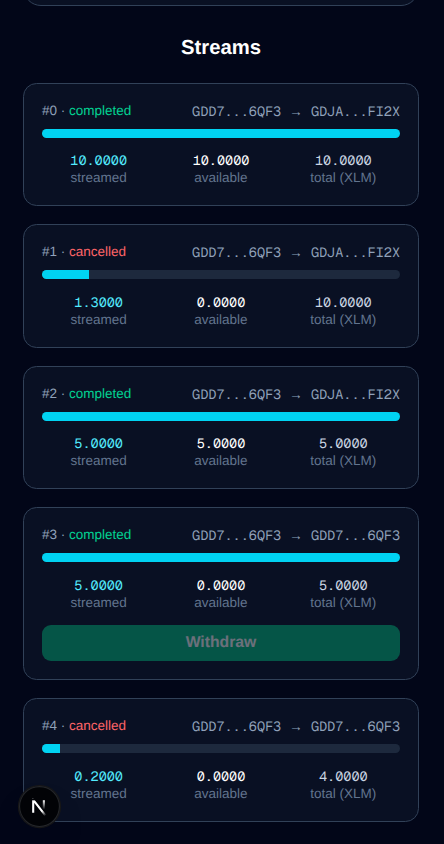
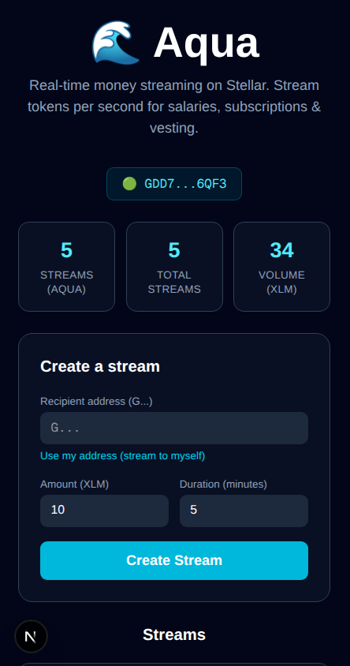
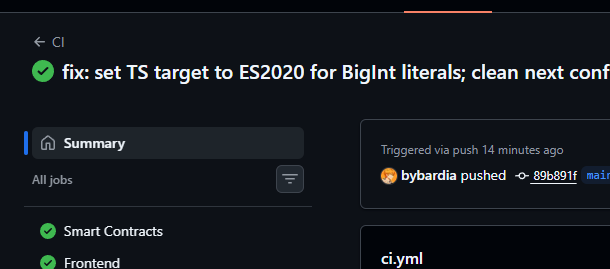
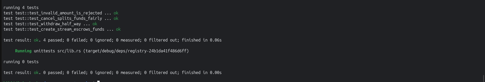

# 🌊 Aqua — Real-time Money Streaming on Stellar

Aqua is a decentralized **money-streaming protocol** built on Stellar Soroban.
Stream tokens **per second** — perfect for salaries, subscriptions, grants, and
token vesting. Recipients withdraw their vested balance at any moment, and
senders can cancel an active stream to get a **fair refund** of the unstreamed
portion.

> ⚠️ **Network:** This dApp runs on the **Stellar Testnet**. Set your Freighter wallet to Testnet to try it.

## ✨ Features
- ⏱️ Per-second linear token streaming
- 💸 Withdraw vested funds anytime (recipient)
- 🛑 Cancel with a fair split (sender reclaims the unstreamed part)
- 📊 On-chain registry tracking total streams & volume
- 🔴 Real-time UI that updates balances every second
- 👛 Freighter wallet integration
- ✅ Full test suite + CI/CD pipeline

## 🏗️ Architecture
| Package | Description |
| --- | --- |
| `contracts/aqua` | Core streaming contract: escrow, create, withdraw, cancel |
| `contracts/registry` | Analytics registry: records streams, tracks totals |
| `frontend` | Next.js + TypeScript + Tailwind dApp with Freighter |

The two Soroban contracts are wired via **cross-contract calls**: whenever a
stream is created, `aqua` records it in the `registry`.

## 📜 Deployed Contracts (Testnet)
| Contract | Address |
| --- | --- |
| Aqua | `CAYCGEXSUJ2SYV5L3OQ52UOCWGNZ7XK6H7ODXAURYCLAE3HPS4SJZUFG` |
| Registry | `CCVABJMB3KN3DVTVJY5FCS5YXMXJKFQYCIRHRRJPQBTFWEDMNFA6P5HV` |

- 🔎 Aqua: https://stellar.expert/explorer/testnet/contract/CAYCGEXSUJ2SYV5L3OQ52UOCWGNZ7XK6H7ODXAURYCLAE3HPS4SJZUFG
- 🔎 Registry: https://stellar.expert/explorer/testnet/contract/CCVABJMB3KN3DVTVJY5FCS5YXMXJKFQYCIRHRRJPQBTFWEDMNFA6P5HV
- 🧾 Sample transaction (initialize): https://stellar.expert/explorer/testnet/tx/6ec37dee236d703d941a5798bcda50377655d5885956a08a54cb6b14024cc8d0

## 🧱 Tech Stack
- **Smart contracts:** Rust + Soroban SDK
- **Tooling:** Stellar CLI
- **Frontend:** Next.js 16 (App Router), TypeScript, Tailwind CSS
- **Web3:** `@stellar/stellar-sdk`, `@stellar/freighter-api`
- **CI/CD:** GitHub Actions

## 🚀 Getting Started
### Prerequisites
- Rust and the `stellar` CLI
- Node.js 20+
- Freighter wallet extension (set to **Testnet**)

### Smart contracts
stellar contract build
cargo test

### Frontend
cd frontend
npm install
npm run dev
Open http://localhost:3000 and connect Freighter. Deployed contract addresses
live in `frontend/lib/config.ts`.

## 🧪 Testing
cargo test
The suite covers token escrow, linear vesting math, fair cancellation splits,
and input validation.

## 🔄 CI/CD
`.github/workflows/ci.yml` runs on every push:
- **Contracts:** `fmt` check, `clippy`, tests, and a `wasm32` build
- **Frontend:** install, lint, and a production build

## 📸 Screenshots
| Desktop | Mobile |
| --- | --- |
|  |  |

**CI/CD pipeline**

**Tests passing**

## 🎥 Demo
- 🌐 **Live demo:** https://aqua-money-streaming.vercel.app/
- 📹 Video walkthrough: _coming soon (YouTube)_

## 📄 License
MIT
